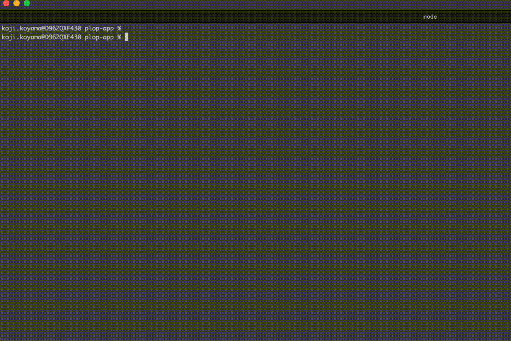

# plop-app

このプロジェクトは、コマンドを使って React のコンポーネントを簡単に生成するためのサンプルアプリケーションです。
コンポーネントの作成と同時に Storybook ファイルも作成します。

複数のコンポーネントをまとめて作成することもできるようになります。



## 依存関係のインストール

```
// volta がインストールされていない場合
curl https://get.volta.sh | bash

volta install
npm install
```

## コンポーネントの生成

Plop を使用して、新しい React コンポーネントを生成できます。
対話形式での作成と、ワンラインコマンドでの作成ができます。

### 対話形式での生成

```
npm run generate:component
```

コマンドを実行すると、対話形式でコンポーネントの名前を入力するように求められます。指定した名前とテンプレートに従って新しいコンポーネントが生成されます。

### ワンラインコマンドでの生成

`name` や `type` を指定することで、対話形式の入力をスキップできます。

```
npm run generate:component -- --name=component_A --type=layout
```

### 複数のコンポーネントをまとめて生成

コンポーネント設計後に、以下のように複数のコマンドを組み合わせて実行し、複数のコンポーネントをまとめて生成することもできます。

```
npm run generate:component -- --name=component_A_1 --type=layout
npm run generate:component -- --name=component_A_2 --type=layout
npm run generate:component -- --name=component_B_1 --type=common
npm run generate:component -- --name=component_B_2 --type=common
npm run generate:component -- --name=component_B_3 --type=common
```


## Storybook の利用

このプロジェクトでは、Storybookを利用してコンポーネントを個別にテストおよびドキュメント化できます。

### Storybook の起動

```
npm run storybook
```
